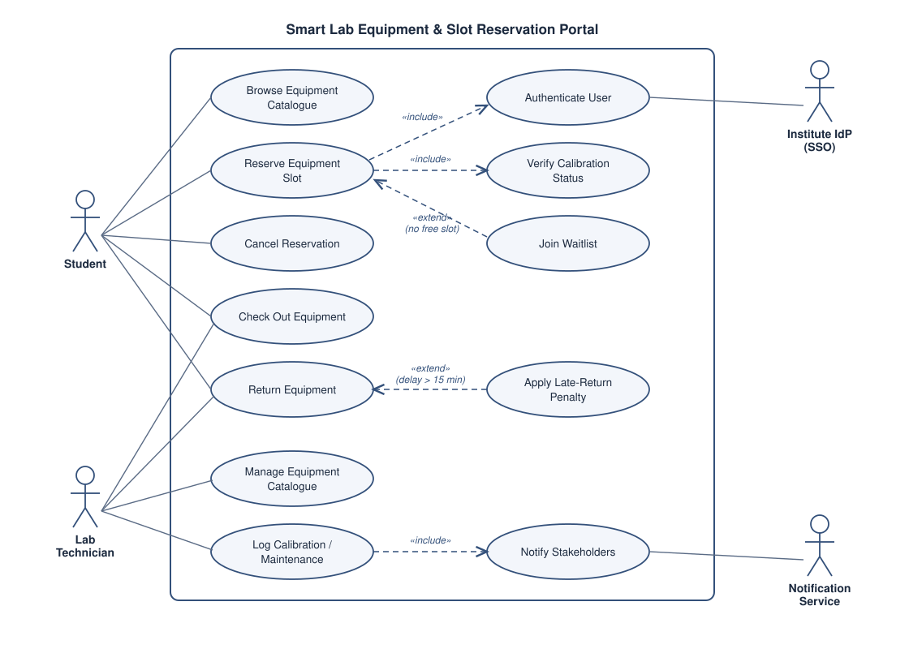

# SE Lab 1 — Requirements Engineering & UML Use-Case Modelling

**Problem Statement #01 — Campus & Academic Operations**
**Smart Lab Equipment & Slot Reservation Portal**

PES University · Dept. of CSE · SRN: **PES1UG24AM274**

---

## Deliverables

| # | Deliverable | File |
|---|---|---|
| 1 | Complete requirements table — 5 Functional Requirements (FR-001 … FR-005) and 2 Non-Functional Requirements (NFR-001, NFR-002) with ID, Type, Description, Priority, Acceptance Criteria and Rationale | [docs/01_requirements.md](docs/01_requirements.md) |
| 2 | UML Use-Case Diagram — all actors and primary use cases, with `«include»` and `«extend»` relationships | [docs/02_use_case_diagram.svg](docs/02_use_case_diagram.svg) (rendered) · [docs/02_use_case_diagram.puml](docs/02_use_case_diagram.puml) (source) |
| 3 | Use-Case Flow Specification — one core use case with Preconditions, Postconditions, Main Success Scenario and an Alternate Flow | [docs/03_use_case_flow.md](docs/03_use_case_flow.md) |

---

## Use-Case Diagram



**Actors:** Student, Lab Technician (primary) · Institute IdP (SSO), Notification Service (secondary)

**Relationships modelled**

- `«include»` *Reserve Equipment Slot* → *Authenticate User* — every reservation is made by an identified student.
- `«include»` *Reserve Equipment Slot* → *Verify Calibration Status* — an uncalibrated asset can never be booked.
- `«include»` *Log Calibration / Maintenance* → *Notify Stakeholders* — students whose bookings are voided are always informed.
- `«extend»` *Join Waitlist* → *Reserve Equipment Slot* — extension point **No Free Slot**.
- `«extend»` *Apply Late-Return Penalty* → *Return Equipment* — extension point **Return delay > 15 min**.

To regenerate the diagram from source:

```bash
java -jar plantuml.jar -tsvg docs/02_use_case_diagram.puml
```

---

## Summary

| | |
|---|---|
| Functional requirements | 5 (FR-001 … FR-005) |
| Non-functional requirements | 2 (NFR-001 Performance & Security, NFR-002 Availability & Auditability) |
| Actors | 4 (2 primary, 2 secondary) |
| Use cases | 12 |
| Documented use-case flow | UC-02 Reserve Equipment Slot (main success scenario + alternate flow AF-1 + 5 exception flows) |
